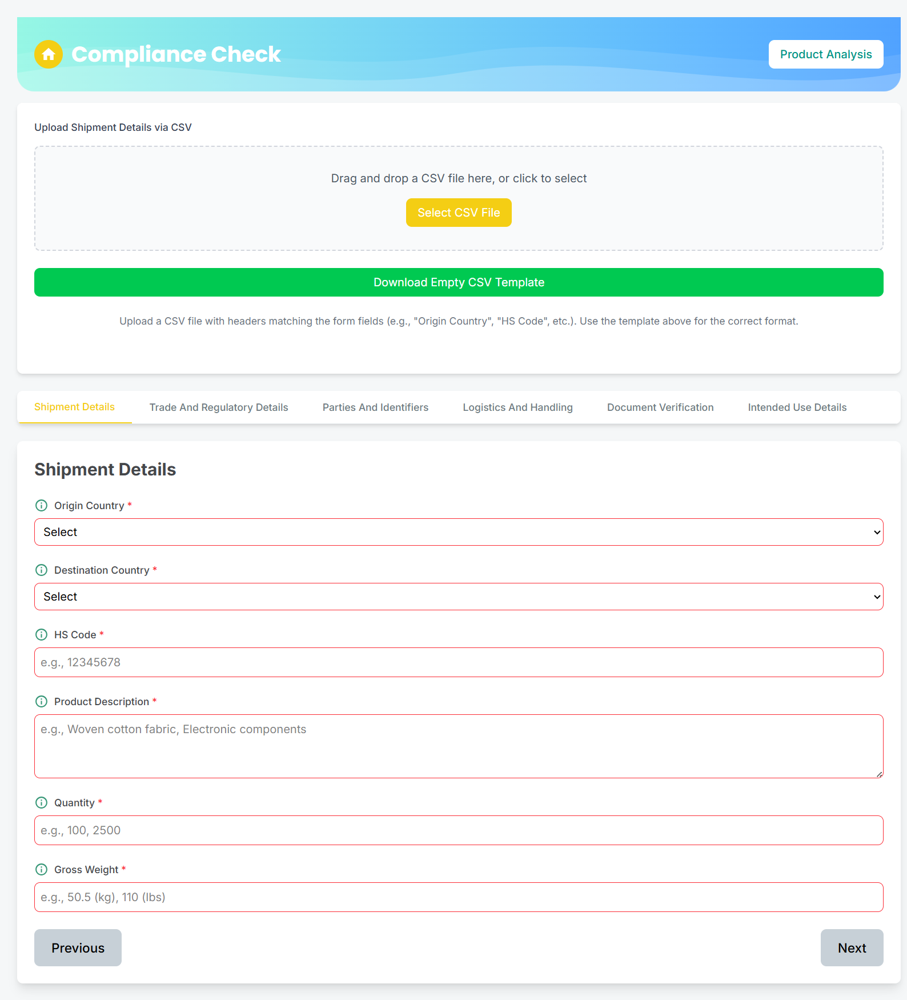
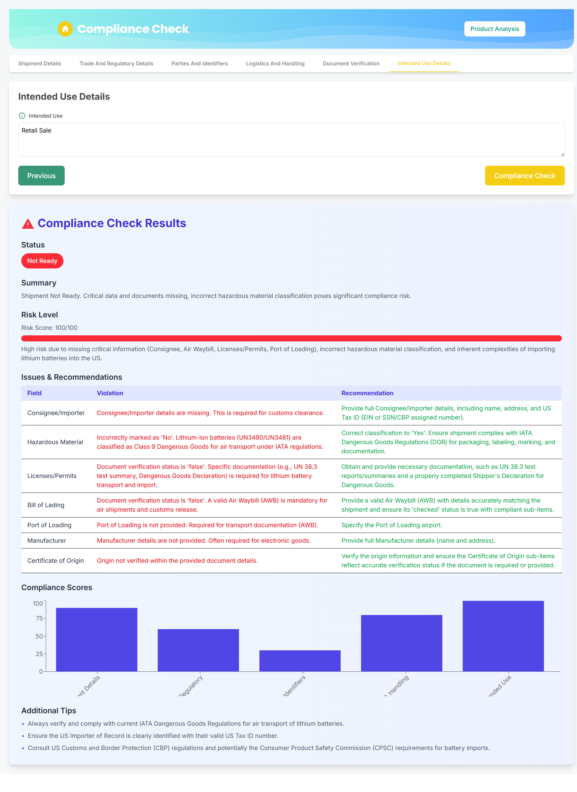
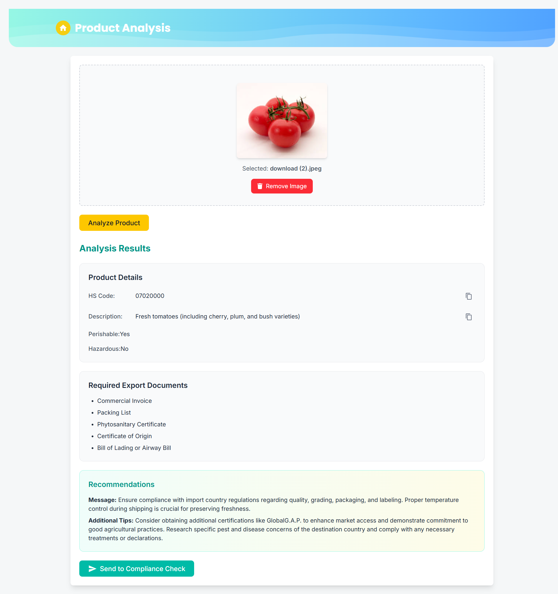
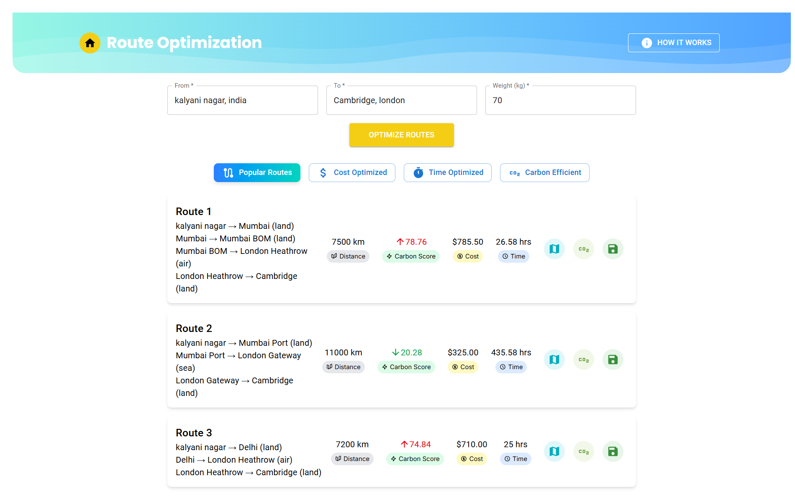
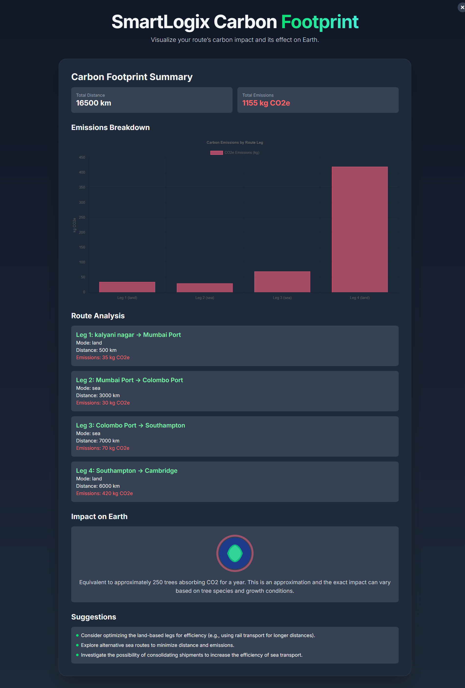

 <!-- Replace with your own banner -->

---

<h1 align="center"> SmartLogix </h1>

SmartLogix is a comprehensive logistics intelligence platform that integrates **AI-powered compliance checks**, **multimodal route optimization**, and **product analysis** to simplify global and domestic shipment planning. Developed using the **MERN stack**, it empowers logistics businesses with smarter decision-making.

---

## 📖 About SmartLogix  

SmartLogix provides a seamless experience for managing international and domestic logistics with the help of advanced AI and cloud technologies. The platform focuses on:  

- Regulatory **compliance validation**
- **Product classification** using image-based AI analysis
- **Route optimization** with cost, carbon, and time efficiency
- Detailed **report generation** and **history tracking**

---  

## 🚀 Features  

### 🔐 Authentication  
- Manual Login with password hashing via **bcrypt**
- **Google OAuth** for one-click login  
- Secured user sessions

---

### 📊 Compliance Check  

- Tab-wise form inputs: Each tab contains **mandatory and optional** fields
- **CSV import** via drag and drop or template download
- Input fields autofilled from uploaded CSV
- Integrated with **Gemini Pro AI** for intelligent compliance evaluation

#### 📄 Compliance Report Includes:
- ✅ Compliance status & summary  
- 🔴 Risk level with reasoning  
- 📊 Field-wise violations and recommendations  
- 📈 Compliance score based on form validity  
- 💡 Additional tips for better compliance  
- 🕒 **Saved to compliance history**  

---

### 🧪 Product Analysis via Image  

- Upload product image for instant AI-based insights  
- Powered by **Google Cloud Vision** + Gemini AI  
- Get:
  - 📦 HS Code  
  - 📃 Product description  
  - ⚠️ Perishable or hazardous info  
  - 📑 Required export documents  
  - 💡 Additional tips  

- 📤 **Send to Compliance** button for autofill into the form

---

### 🛣️ Route Optimization  

- Input shipment **source, destination, and weight**
- Multimodal routing with:
  - 🗺️ Route cards showing:
    - Checkpoints
    - Transport modes
    - Total distance
    - Cost
    - Time
    - Carbon score  
  - 📘 “How it works” section explains calculations

#### Tabs Include:
1. **Popular Routes** – 3 most used real-world routes  
2. **Cost Optimized** – Top 3 cheapest paths  
3. **Time Optimized** – Fastest routes  
4. **Carbon Efficient** – Eco-friendly logistics suggestions  

#### Each Route Card Offers:
- 🗺️ **Map View** – Color-tagged paths on world map  
- ♻️ **Carbon Breakdown** – Emissions, Earth impact, suggestions  
- 💾 **Save Route** – Store in user’s profile  

---

### 👤 User Profile  

- History of:
  - ✔️ Compliance reports
  - 🛣️ Saved routes

---

## 🖼 Screenshots  

1. **Login:**  
   

2. **Compliance Check:**  
   

3. **Compliance Check Report:**  
   

4. **Product Analysis:**  
   

5. **Route Optimization:**  
   

6. **Map Representation:**  
   

7. **Detailed Carbon Footprint Analysis:**  
   

8. **User Profile:**  
   

---

## 🛠 Tech Stack  

| 🧩 Component           | 🔧 Technology                                                                 |
|------------------------|-------------------------------------------------------------------------------|
| **Frontend**           | React.js, TailwindCSS                                                         |
| **Backend**            | Node.js, Express.js                                                           |
| **Database**           | MongoDB                                                                       |
| **Authentication**     | Bcrypt for hashing, Google OAuth                                              |
| **AI/ML APIs**         | Gemini Pro, Google Cloud Vision                                               |
| **Deployment**         | Frontend: Vercel Backend: Render                                           |
| **Google APIs**        | Maps API, Geolocation API, Geocoding API, Routes API, Polylines API, Cloud Storage Bucket |

---

## 🧠 Algorithmic Systems  

| ⚙️ Module                | 🔍 Description                                                                                     |
|--------------------------|--------------------------------------------------------------------------------------------------|
| **Route Optimization**   | Multimodal path planning across Land, Sea, and Air using waypoint logic and Google Routes        |
| **Cost Estimation**      | Real-world simulation based on distance, transport mode, and scalable cargo volume                |
| **Time Calculation**     | Duration computed using mode-specific speeds and delays at ports/waypoints                        |
| **Carbon Score Calculation** | CO₂ footprint estimation using per-mode emission rates normalized per km                        |
| **Distance Calculation** | Accurate great-circle distance computation between coordinates                                    |
| **Compliance Check**     | AI-based validation using WCO standards for HS code legality, import rules     |
| **Risk Scoring Algorithm** | Weighted penalty system (0–100) based on field completeness, document presence, context risks (hazardous, dual-use), banned goods, and route complexity |

---

💡 **SmartLogix** bridges logistics intelligence with AI to enhance compliance, optimize shipping, and streamline trade documentation—**all in one place**.
