

  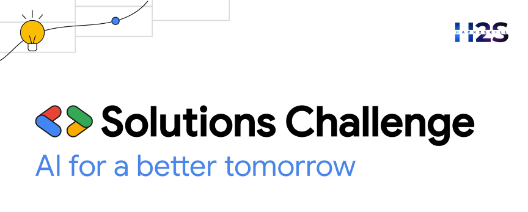

---

  
  

    SmartLogix
  

  
  
  
  

> 🚀 _A comprehensive logistics intelligence platform that integrates AI-powered compliance checks, multimodal route optimization, and product analysis to simplify global and domestic shipment planning._

---

## 📋 About SmartLogix

SmartLogix is a **next-generation logistics intelligence platform** designed to streamline and enhance the management of global and domestic shipments. Built on the **MERN stack** (MongoDB, Express.js, React.js, Node.js), SmartLogix leverages advanced AI and cloud technologies to provide comprehensive solutions for logistics businesses.

The platform simplifies complex logistics operations by integrating **AI-powered compliance checks**, **multimodal route optimization**, and **intelligent product analysis**. SmartLogix is accessible via a secure web interface and offers robust features for **authentication**, **inventory management**, **analytics**, and **user support**.

---

## ✨ Features

### 🔐 Authentication & User Management

#### ✅ Secure Access Control

- 🔑 Login/Create Account with secure password hashing using **bcrypt**
- 🔗 Google OAuth integration for one-click authentication

---

### ✅ Compliance Check

#### 🤖 AI-Powered Regulatory Validation

- 📝 Manual form completion with mandatory and optional fields
- 📁 CSV upload functionality with template download option
- 🔍 Product analysis integration for auto-filling compliance fields
- 🧠 Gemini Pro AI integration for intelligent compliance evaluation based on **WCO standards**
- 📊 Comprehensive compliance reports including:
  - 🟢 Compliance status and summary
  - ⚠️ Risk level assessment with detailed reasoning
  - 🧾 Field-wise violation analysis and recommendations
  - 🧮 Compliance score based on form validity
  - 💡 Actionable tips for improved compliance
- 🕓 Complete history tracking of all compliance checks

---

### 🔬 Product Analysis

#### 🖼️ Image-Based AI Analysis

- 📸 Product image upload for instant AI-powered insights
- ☁️ Google Cloud Vision and Gemini AI integration
- 🧾 Automated generation of:
  - 🧾 HS Code classification
  - 📝 Detailed product descriptions
  - 🧪 Perishable and hazardous material identification
  - 📃 Required export documentation lists
  - 📌 Additional compliance tips
- 🔗 Direct integration with compliance check forms for seamless data transfer

---

### 🛣️ Multimodal Route Optimization

#### 🧠 Intelligent Route Planning

- 🗺️ Input specification for shipment origin, destination, and package details
- 🔄 Multiple route optimization categories:
  - ⭐ **Popular Routes**: Top 3 most frequently used real-world routes
  - 💸 **Cost Optimized**: Most economical shipping paths
  - ⏱️ **Time Optimized**: Fastest delivery routes
  - 🌱 **Carbon Efficient**: Environmentally conscious logistics options

#### 📍 Route Card Features

- 🔎 Comprehensive route information including waypoints, distance, time estimates, costs, and carbon scores
- 🗺️ Interactive map visualization with color-coded route paths
- 🌍 Detailed carbon footprint analysis with environmental impact assessments
- 💾 Route saving functionality for future reference
- 📦 Route selection with automatic draft creation and inventory management

---

### 📦 Inventory Management

#### 📋 Comprehensive Draft Management System

- **All Drafts**: Complete overview of all draft records

- **Yet to be Checked**: Drafts requiring review process

  - ✍️ Manual draft creation capability
  - ⚙️ Automatic draft generation from product analysis and route optimization
  - 🔗 Direct integration with compliance check system for auto-filled forms

- **Noncompliant**: Failed compliance check management

  - 🔁 Re-submission capability for compliance re-evaluation
  - ✏️ Edit and update functionality for draft improvement

- **Compliant**: Approved drafts awaiting route optimization

  - 🔗 Direct integration with route optimization system
  - ➡️ Seamless workflow progression

- **Ready for Shipment**: Fully processed drafts
  - 📤 Complete export reports with comprehensive data including form information, compliance responses, chosen routes, map views, and carbon analysis
  - 🧾 PDF export functionality for documentation

---

### 👤 User Profile and History

#### 🧑‍💼 Comprehensive User Management

- 📄 Profile information display with logout functionality
- 🏅 Achievement badges based on route selection patterns
- ⚙️ Account management features including profile picture updates, username/password editing, and account deletion
- 📂 Complete draft overview with date filtering and search capabilities

#### 🗂️ Organized History Tracking

- 📜 **Compliance History**: All past compliance evaluations
- 🗺️ **Saved Routes**: User-saved route collection
- 🔍 **Product Analysis**: Complete product analysis records
- 🧹 Individual history item deletion capability

---

### 📊 Analysis Dashboard

#### 📈 Visual Analytics Platform

- 📉 Data visualization for compliant records with optimized routes
- 📊 Trend analysis and pattern identification tools
- ⚙️ Operational insights for logistics optimization

---

### 📰 News Section - Disruption Alerts

#### 📡 Real-Time Logistics Intelligence

- 🌀 Disruption event monitoring including natural disasters, geopolitical shifts, and pandemics
- 📅 Five-day news filtering with date-based organization
- 📰 Comprehensive news cards featuring:
  - 🏷️ Article titles and publication dates
  - 🗞️ Publisher information and source links
  - 📃 Detailed summaries and shipment impact assessments
  - ⚠️ Cautionary advice and recommendations

---

### 📚 Documentation and Support

#### 📖 Comprehensive User Resources

- 📘 Complete feature documentation and user guides
- 📧 Support email contact system
- 🎥 Platform usage tutorials and resources

---

### 🤖 Chatbot Assistance

#### 🗣️ Intelligent User Support

- 💬 Real-time assistance across all platform features
- 🤖 Dialogflow CX and React integration for seamless user interaction
- 🧠 Context-aware help and guidance system

---

## 🖼️ Platform Screenshots

Click on the points below to view the corresponding screenshots (dropdowns).

  
🔐 Login

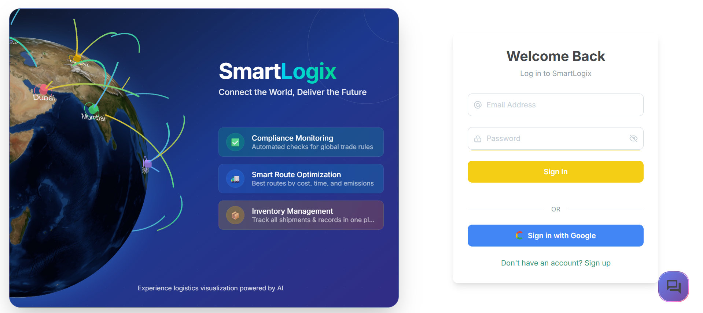

  
✅ Compliance Check Options

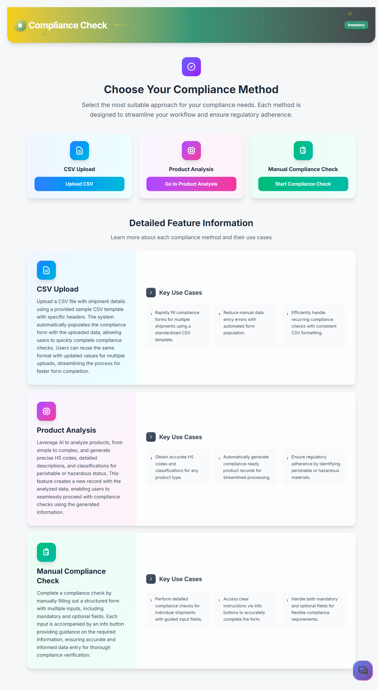

  
📁 CSV Upload

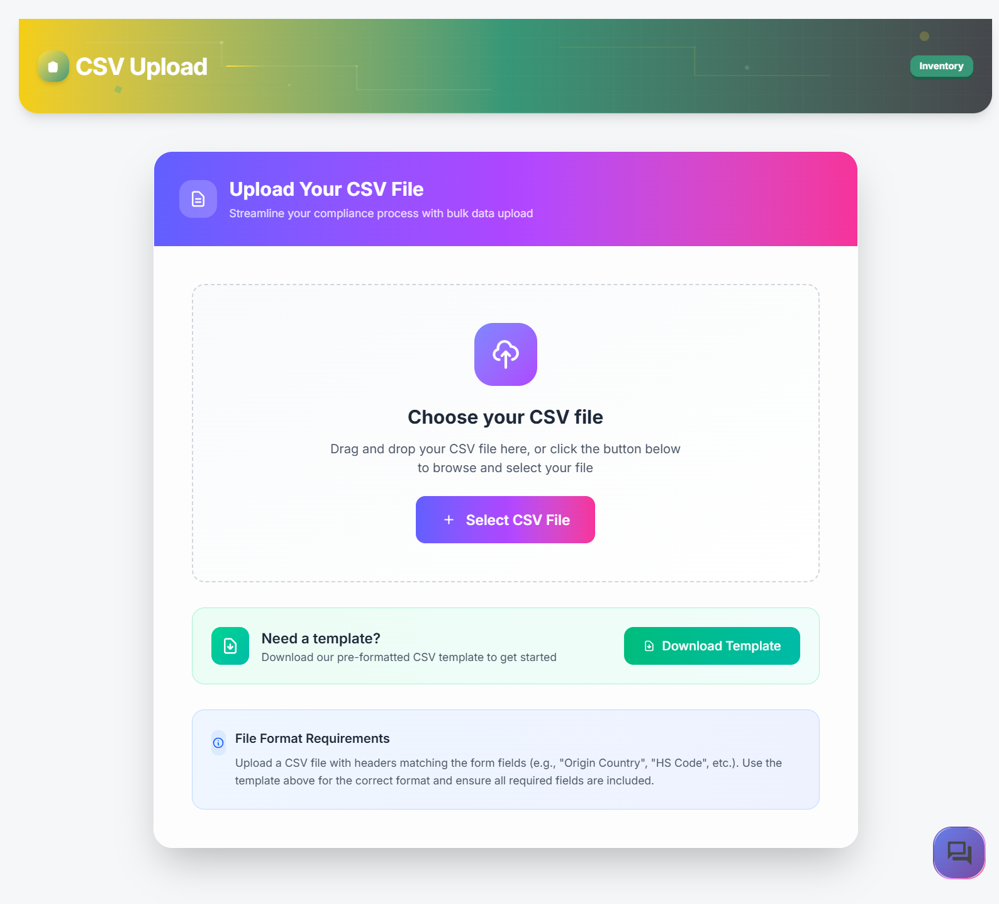

  
🔬 Product Analysis

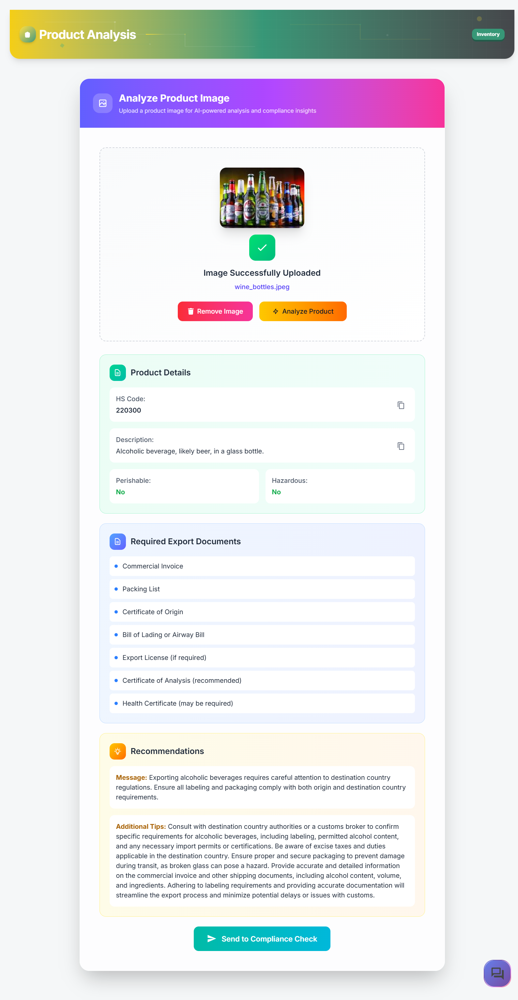

  
📋 Compliance Check Form

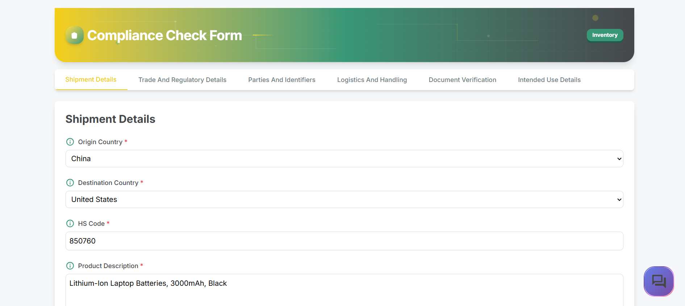

  
📑 Compliance Report

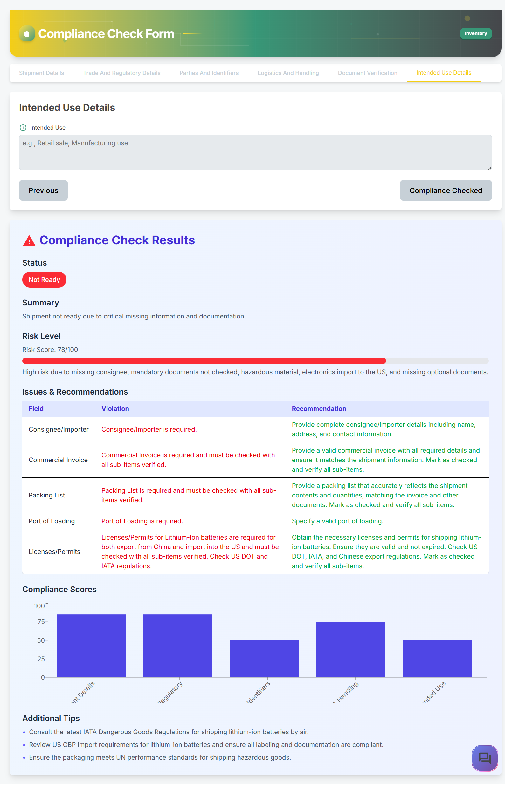

  
🛣️ Route Optimization

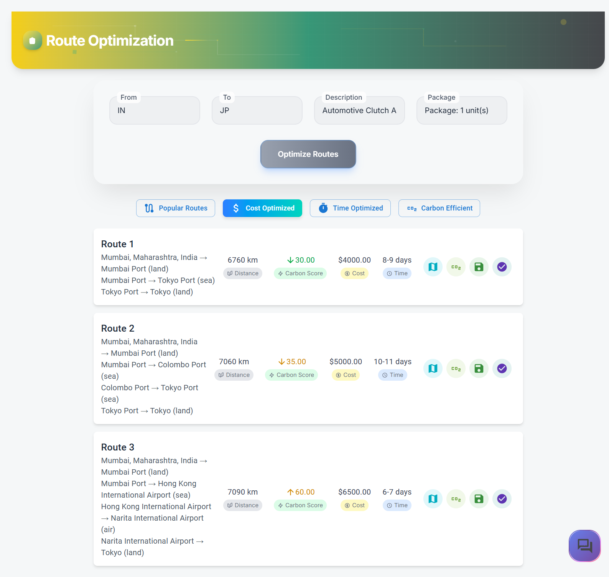

  
🗺️ Map View

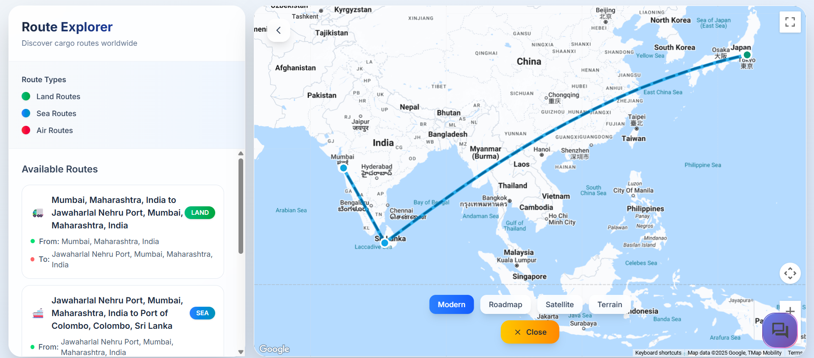

  
🌱 Carbon Footprint Analysis

  
📦 Inventory Management

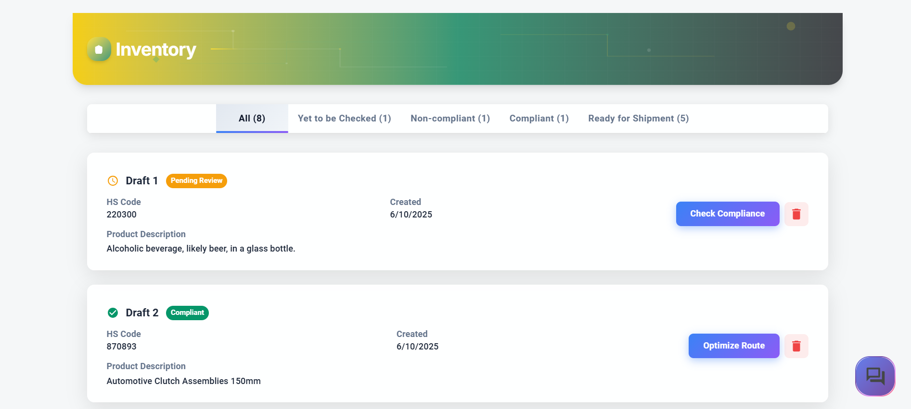

  
📤 Export Report

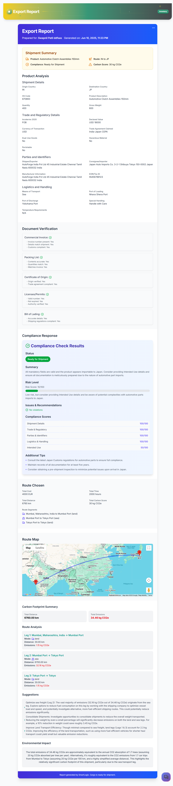

  
👤 User Profile

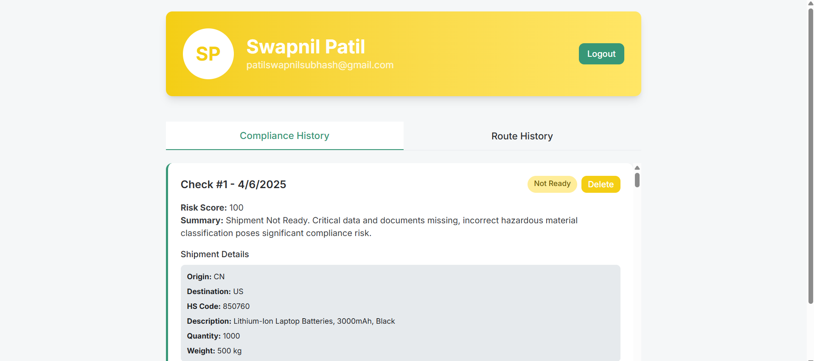

  
⚙️ Manage Account

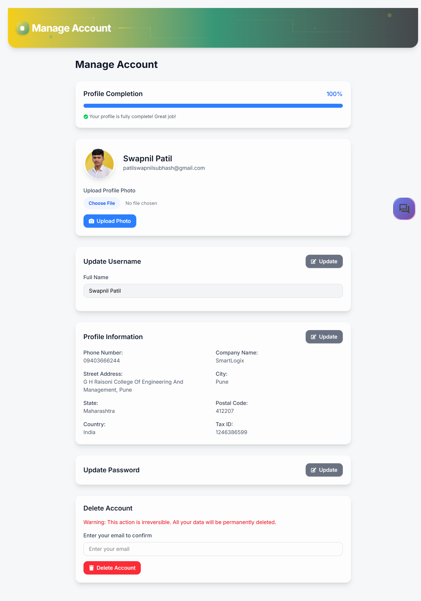

  
📚 History

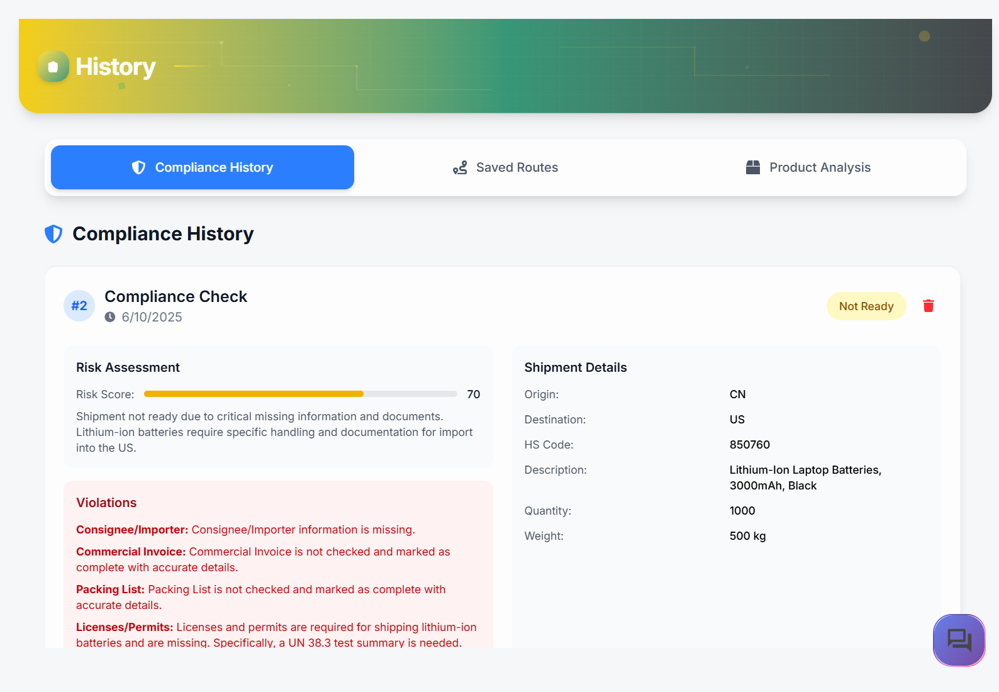

  
📊 Analysis Dashboard

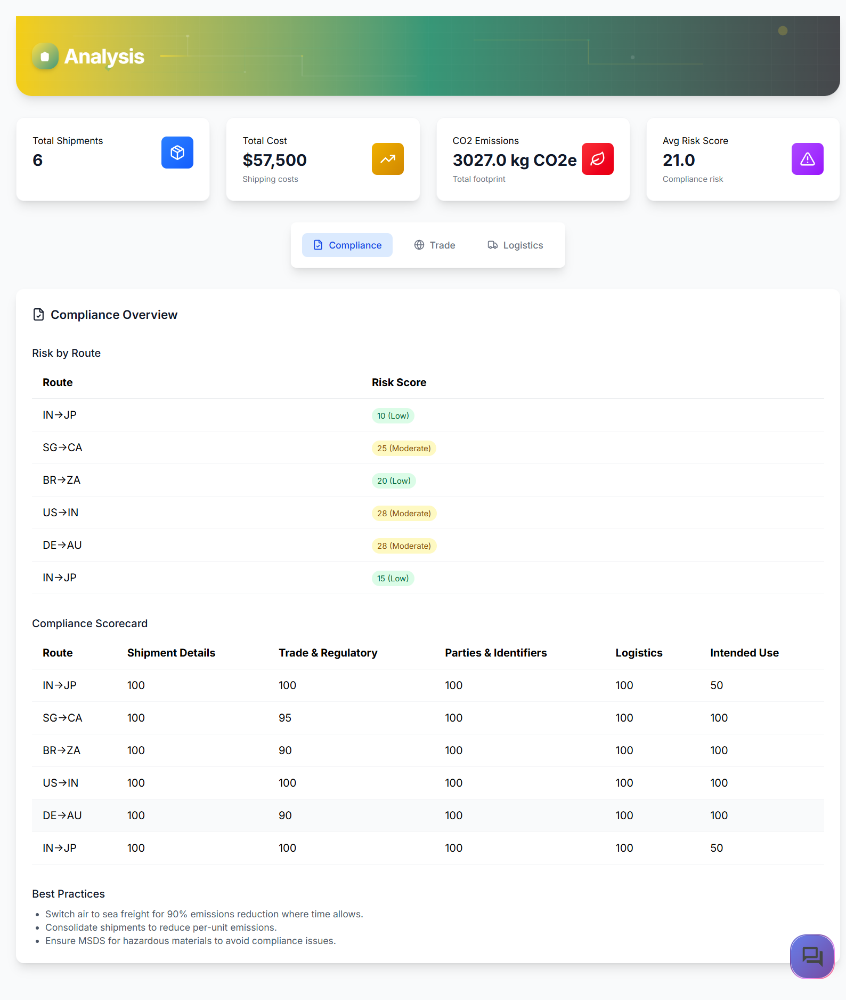

  
📰 News Section

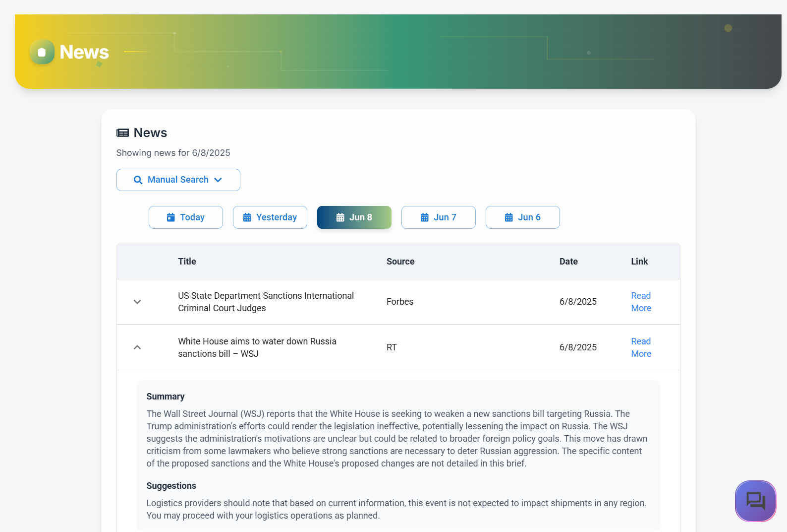

  
📖 Documentation

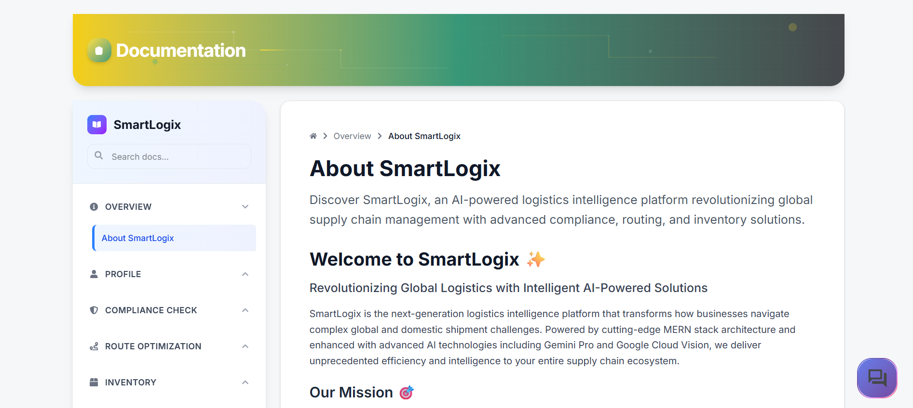

  
🤖 Chat Bot

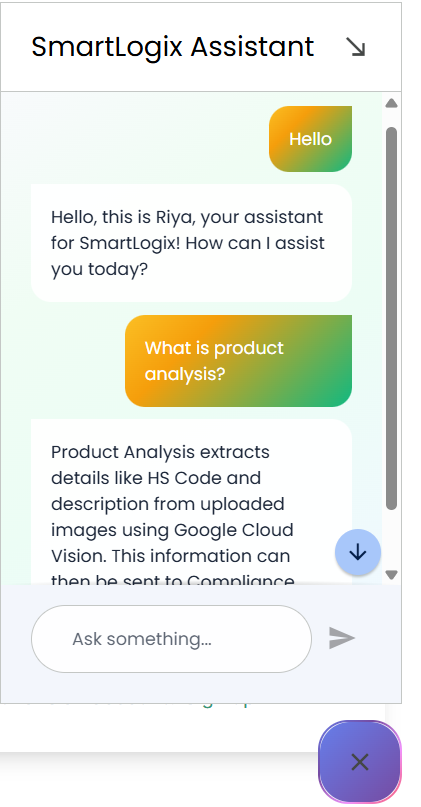

---

## 🛠 Tech Stack

| 🧩 Component       | 🔧 Technology                                                                                                                                                                                                                                                                                                                                                                                                                                                 |
| ------------------ | ------------------------------------------------------------------------------------------------------------------------------------------------------------------------------------------------------------------------------------------------------------------------------------------------------------------------------------------------------------------------------------------------------------------------------------------------------------- |
| **Frontend**       |           |
| **Backend**        |                                                                                                                                                                                                                                    |
| **Database**       |                                                                                                                                                                                                                  |
| **Authentication** |                                                                                                                                                            |
| **APIs & AI**      |                                                                                                                                                 |
| **Deployment**     |                                                                                                                                                                                                                                                                                                                                 |

---

## 🤖 Google AI Tools Integrated

| 🔧 Tool/Service                                                                                                                           | 📌 Description                                                         |
| ----------------------------------------------------------------------------------------------------------------------------------------- | ---------------------------------------------------------------------- |
|  | Used for intelligent compliance, text generation, and decision support |
|    | AI-powered product image analysis and classification                   |
|    | Build generative AI apps for user assistance                           |
|            | AI chatbot for real-time, context-aware platform support               |

---

## 🧱 Google Technologies Used

| 🔧 Technology                                                                                                                                  | 📌 Purpose                                                       |
| ---------------------------------------------------------------------------------------------------------------------------------------------- | ---------------------------------------------------------------- |
|  | Converts location input into usable geocoordinates               |
|            | For rendering interactive and dynamic maps                       |
|                | Provides optimal shipping and delivery paths                     |
|             | Deploy and scale backend microservices easily                    |
|           | Automates deployment and build pipelines                         |
|     | Flexible NoSQL DB for structured data                            |
|  | Scalable storage for user uploads, compliance files, and exports |

---

## 🧠 Algorithmic Systems

| ⚙️ **Module**               | 🔍 **Description**                                                                                                                                            |
| --------------------------- | ------------------------------------------------------------------------------------------------------------------------------------------------------------- |
| 🛣️ **Route Optimization**   | Multimodal path planning across Land, Sea, and Air using waypoint logic and Google Routes API for efficient shipment pathways.                                |
| 💰 **Cost Estimation**      | Real-world simulation based on travel distance, selected transport mode, and dynamic cargo volume to generate cost projections.                               |
| ⏱️ **Time Calculation**     | Estimated shipment duration calculated using mode-specific average speeds, along with anticipated delays at ports or key waypoints.                           |
| 🌱 **Carbon Score**         | CO₂ footprint estimation computed via per-mode emission rates, normalized per kilometer for environmental impact analysis.                                    |
| 📏 **Distance Calculation** | Great-circle (haversine) distance computation between coordinates for precise routing and time/cost accuracy.                                                 |
| ✅ **Compliance Check**     | AI-driven validation leveraging WCO standards to evaluate HS code legality, import/export regulations, and document completeness.                             |
| ⚠️ **Risk Scoring**         | Weighted penalty scoring system (0–100) based on form completeness, document presence, contextual risk (e.g., hazardous goods), and route complexity factors. |

---

---

> 💡 **SmartLogix** bridges logistics intelligence with AI to enhance compliance, optimize shipping routes, and streamline global trade documentation — **all in one platform**.
